# stochastic proces

- [stochastic proces](#stochastic-proces)
  - [homework](#homework)
  - [预备知识](#预备知识)
  - [Concept](#concept)
    - [example](#example)
    - [homework2](#homework2)
  - [possion](#possion)
  - [Morkov](#morkov)

## homework

- 题型
  - 4计算
  - 2证明
  - 2简答

- 作业1
  - 1.定义1.1 （4）（5）（6）证明过程
  - 2.定义1.2 （4）（5）证明过程
- 作业2（课后习题2） 2.2，2.3，2.6
- 作业3（课后习题3） 3.1，3.3，3.9。
- 作业4（课后习题4）4.5，4.10，4.12

## 预备知识

- 定义1.1
  - 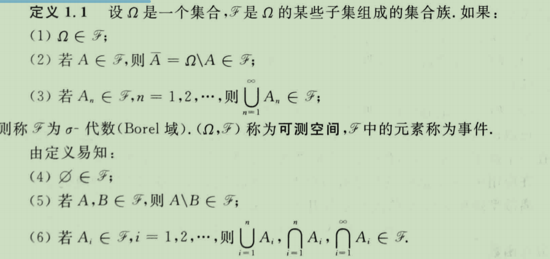
  - 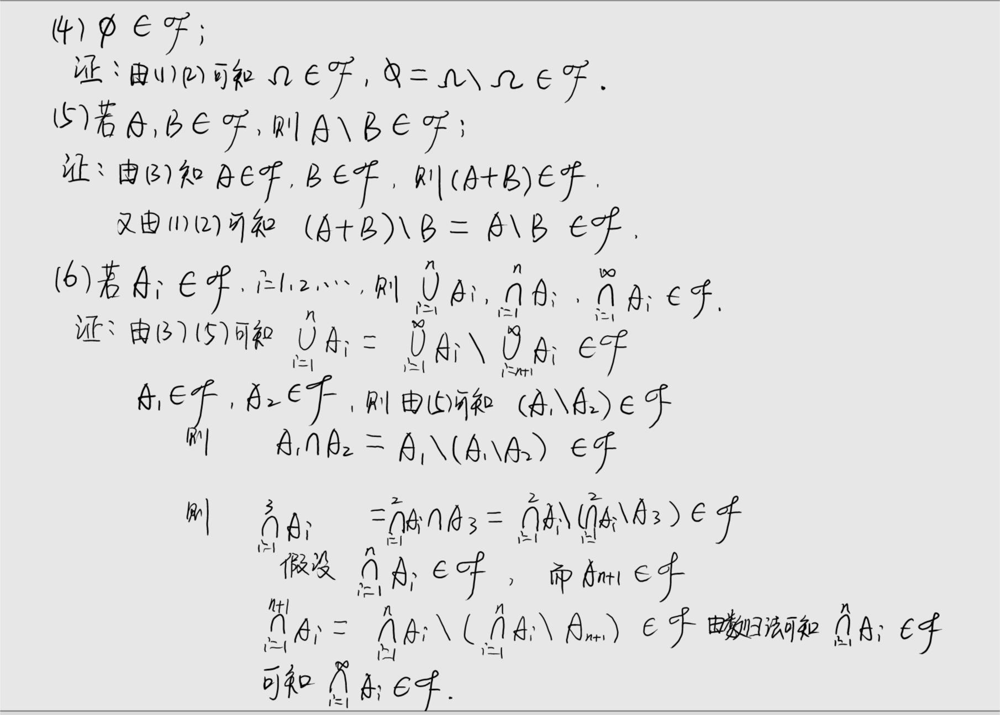
- 定义1.2
  - 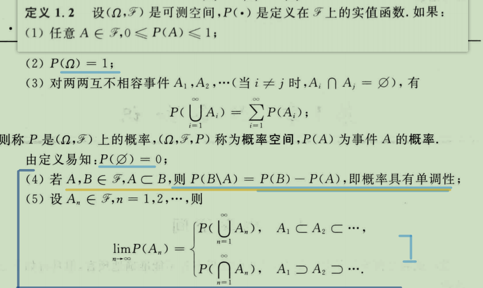
  - 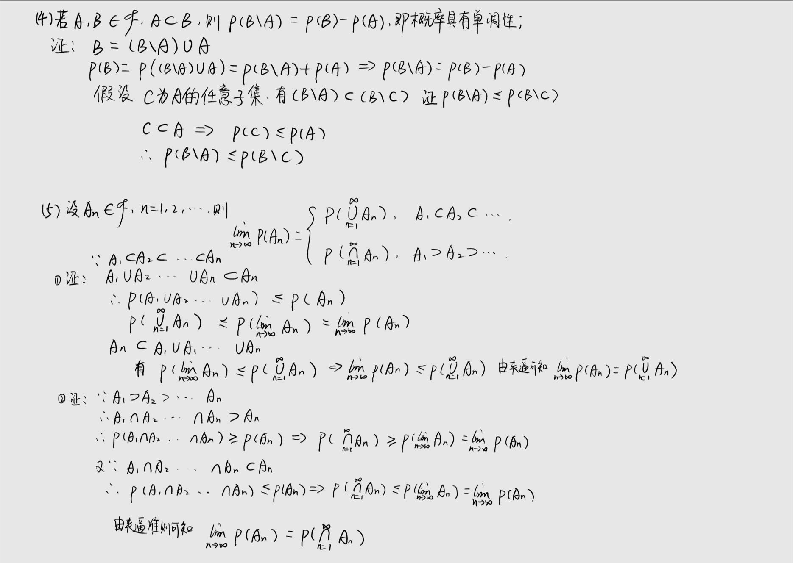

## Concept

### example

- 2.5
  - 
  - 

### homework2

- ⭐2.2
  - 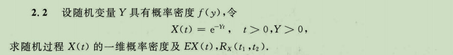
  - 

- 2.3
  - 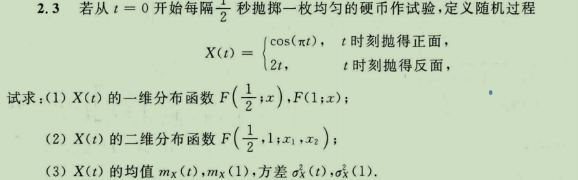
  - (1)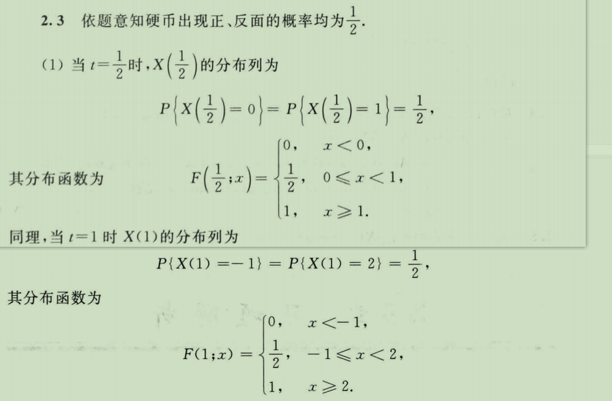
  - (2)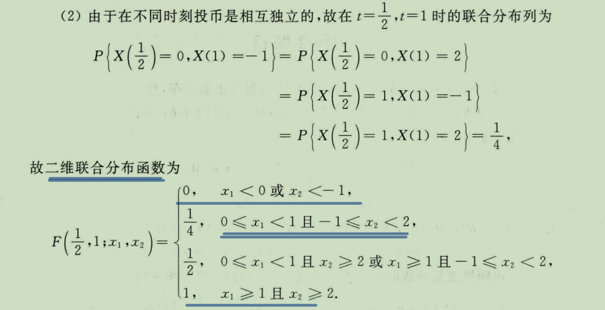
  - (3)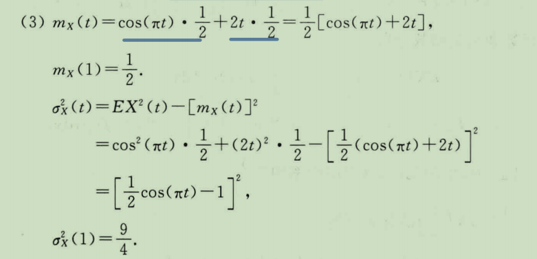

- 2.6
  - 
  - 

## possion

- 3.1
  - 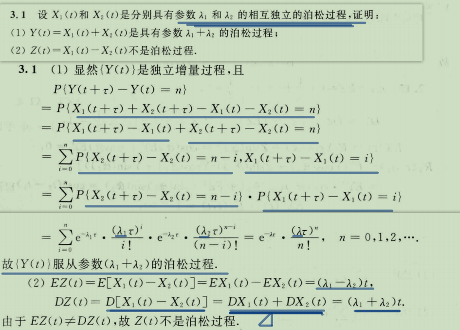
- 3.3
  - 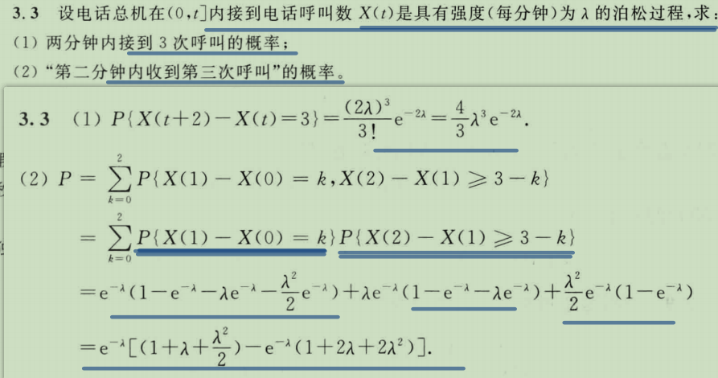
- 3.9
  - 

## Morkov

- 4.5
  - 
- 4.10
  - 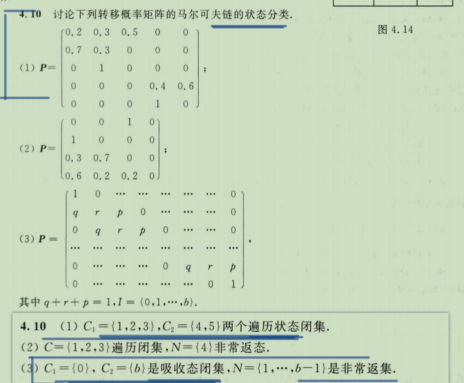
- 4.12
  - 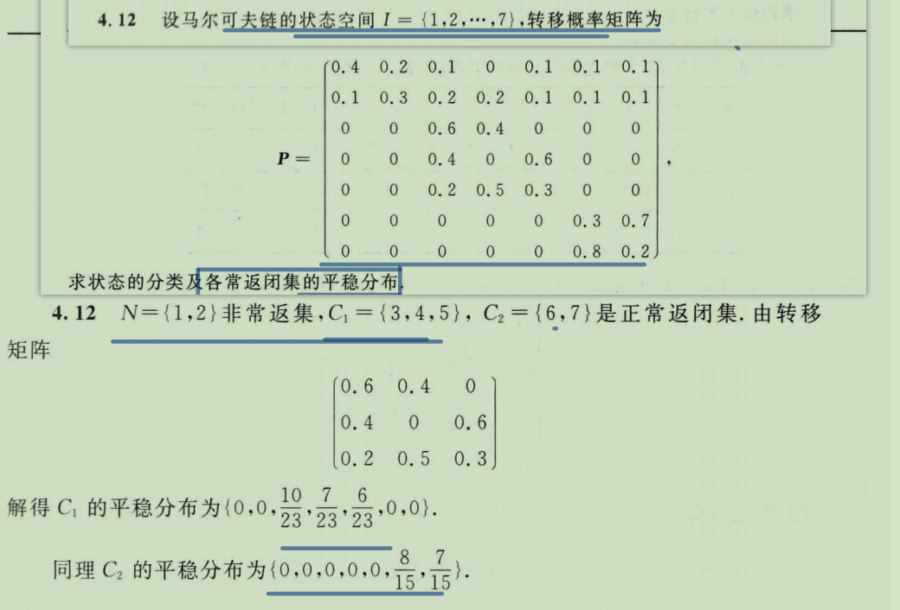