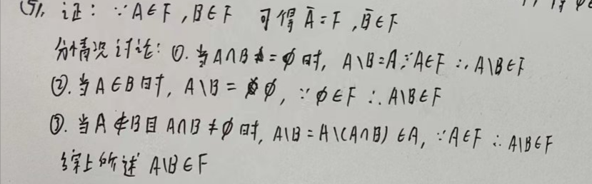

# stochastic proces

- 题型
  - 4计算
  - 2证明
  - 2简答

- 作业1
  - 1.定义1.1 （4）（5）（6）证明过程
  - 2.定义1.2 （4）（5）证明过程
- 作业2（课后习题2） 2.2，2.3，2.6
- 作业3（课后习题3） 3.1，3.3，3.9。
- 作业4（课后习题4）4.5，4.10，4.12

- [stochastic proces](#stochastic-proces)
  - [预备知识](#预备知识)
  - [随机过程的概念与基本类型](#随机过程的概念与基本类型)
    - [example](#example)
    - [homework](#homework)
  - [possion](#possion)

## 预备知识

若$A,B \in \mathfrak{B}$,则$A-B\in \mathfrak{B}$，对吗，请证明

- 

若$A_i \in \mathfrak{B},i=1,2,..,$则$\cup_{i=1}^nA_i,\cap_{i=1}^nA_i,\cap_{i=1}^{\infty}A_i \in \mathfrak{B}$吗，对吗，请证明

- ⭐(6)证明

- 定义1.2⭐
- $A,B \in \mathfrak{B},A \subseteq B, 则P(B-A)=P(B)-P(A)$吗，为什么

## 随机过程的概念与基本类型

### example

- 2.5
  - 
  - 

### homework

- 
- ⭐

- 2.6
- 

## possion

- 

## Morkov

- 