# 矩阵论

- 例1.20
- 习题2.1.5
  - 范数等价
  - 定理2.1的证明
- 例3.14
- 例4.11
- 习题5.4.8
- 例6.10

- [矩阵论](#矩阵论)
  - [some cal](#some-cal)
  - [Unit1](#unit1)
  - [Unit2](#unit2)
  - [Unit3](#unit3)
  - [Unit4](#unit4)
  - [Unit5](#unit5)
  - [Unit6](#unit6)
  - [question](#question)

## some cal

已知

$$
P^{-1}AP =
\begin{bmatrix}
  -1 & 0 & 0 \\
  0 & -1 & 0  \\
  0 & 0 & -2 \\
\end{bmatrix}
$$

WHY

$$
e^{A(2t)} =
\begin{bmatrix}
  e^{-2t} & 0 & 0 \\
  0 & e^{-2t} & 0  \\
  0 & 0 & e^{-4t} \\
\end{bmatrix}
$$

- 

## Unit1

已知

$$
A =
\begin{bmatrix}
  1 & 1 & -1 \\
  1 & 1 & 1  \\
  0 & -1 & 2 \\
\end{bmatrix}
$$

求$A^{100}+2A^{50}$

- 1.20
  - 

- $\psi(\lambda) = \lambda^{100} + 2\lambda^{50}$
- $\varphi(\lambda) = det(\lambda I-A) = (\lambda-1)^2(\lambda-2)$
- 用$\varphi(\lambda)$除$\psi(\lambda)$，可得$\psi(\lambda) = \varphi(\lambda)q(\lambda)+b_0+b_1\lambda + b_2\lambda^2$
- $\psi(\lambda) = \varphi(\lambda)q(\lambda)+b_0+b_1\lambda + b_2\lambda^2$是怎么来的
  - 

- 当$\varphi(\lambda)$为四次方，余式是什么样的
  - 

## Unit2

- $l_2$
  - 
- $l_\infty$
  - 
- $l_1$
  - 
- $l_p$
  - 

- 定理2.1
  - 
- 证明范数等价
- 习题2.1.5
  - 
  - 

## Unit3

- 定义3.12
  - 
- 例子3.14
  - 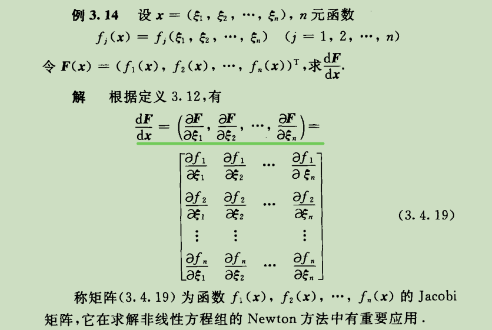

## Unit4

- 

## Unit5

- 前置知识
  - 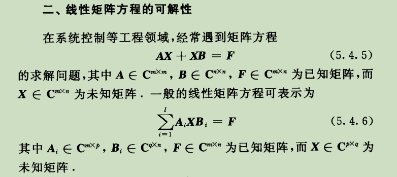
  - 定理5.31
    - 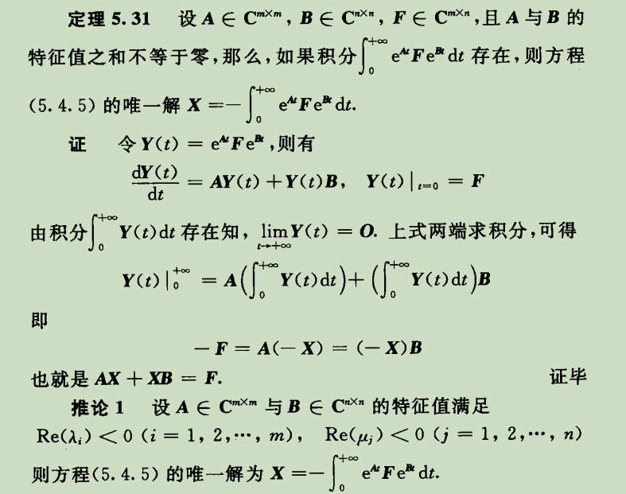
      - 特征值的实部小于零

- 
  - 

## Unit6

- 前置知识
  - 最小二乘解
    - 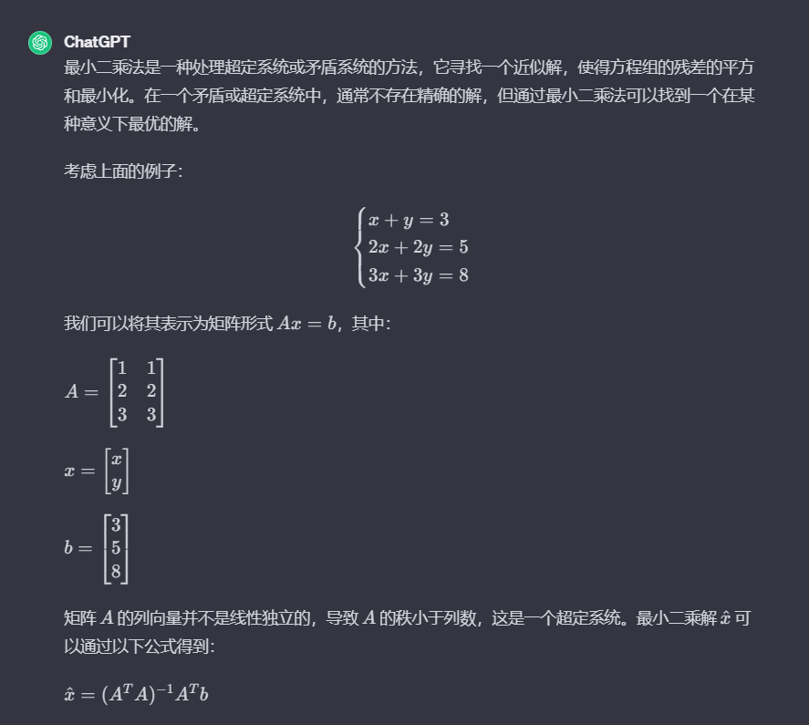
  - 极小范数
    - 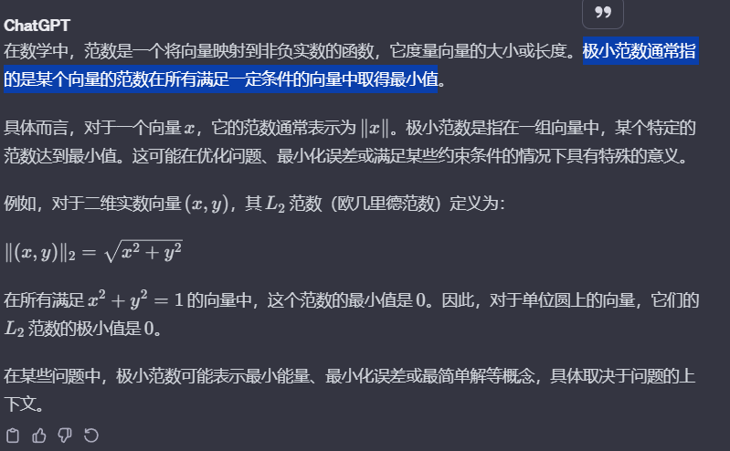
  - $A^H$
    - 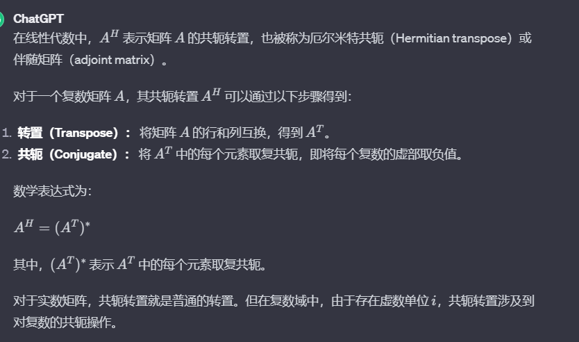
  - $A^+$
    - 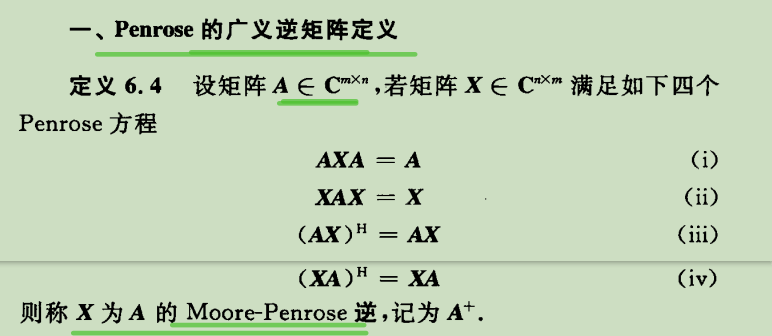
  - 计算$A^+$
    - 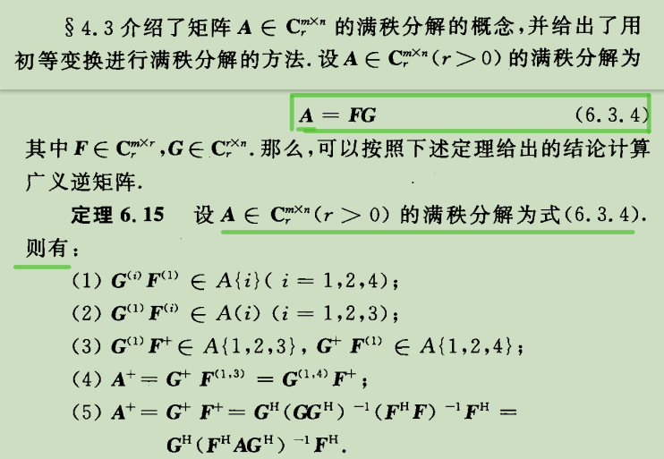
- 例子6.5
  - 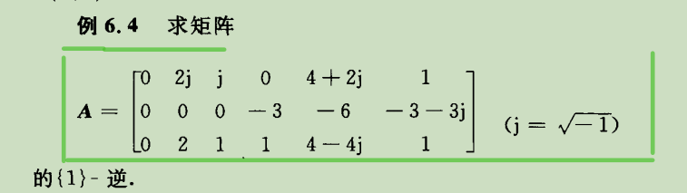
  - 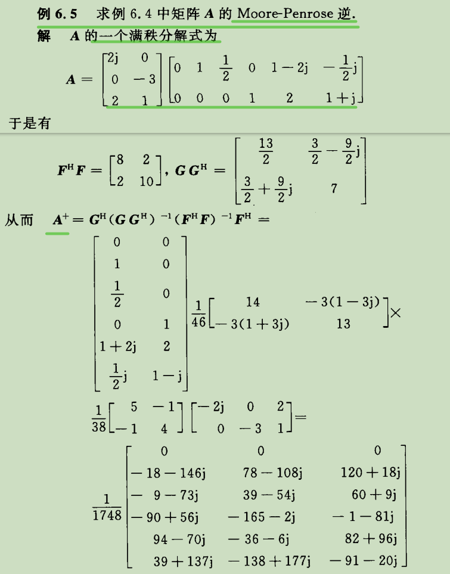

- 定理6.33
  - 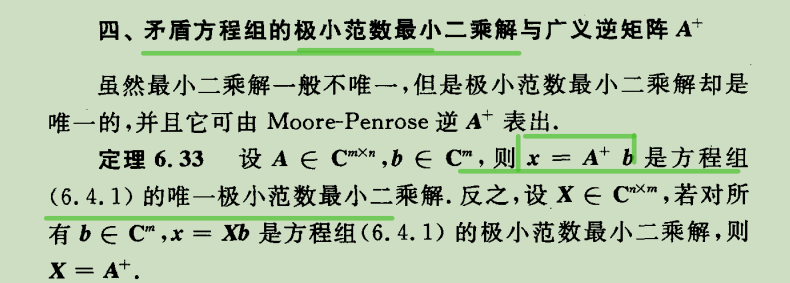
- 例子6.10
  - 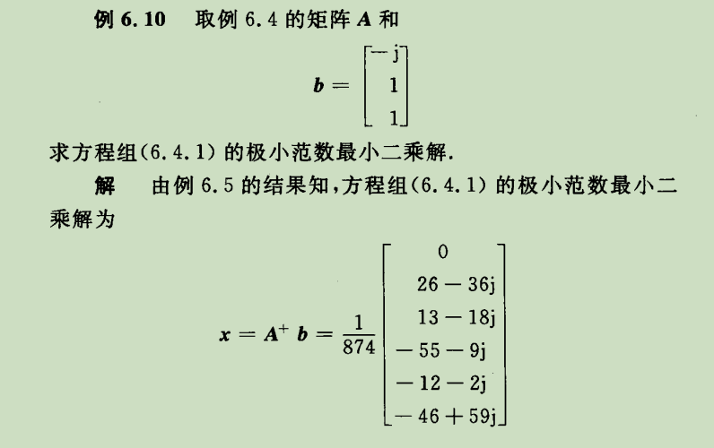
- real 6.10
  - 

## question

- Unit2
  - 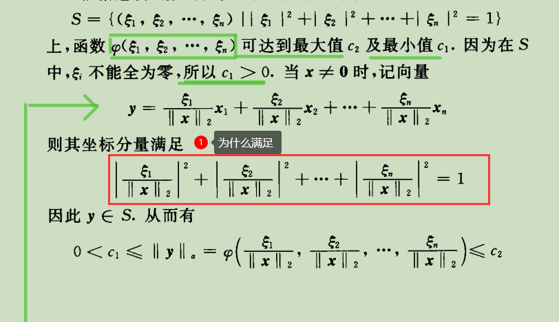
- Unit5
  - p怎么求
    1. 求特征值
    2. 求特征向量
    3. 特征向量构成$p$
    4. 初等变换法求$p^{-1}$
