# 矩阵论

- 例1.20
- 习题2.1.5
  - 范数等价
  - 定理2.1的证明
- 例3.14
- 例4.11
- 习题5.4.8
- 例6.10

## 1.20

已知

$$
A =
\begin{bmatrix}
  1 & 1 & -1 \\
  1 & 1 & 1  \\
  0 & -1 & 2 \\
\end{bmatrix}
$$

将

$$
A =
\begin{bmatrix}
  0 & 0 & 1 \\
  2 & 1 & 1  \\
  2j & j & 0 \\
\end{bmatrix}
$$

化为Hermite标准型(一步步写出)

求2*A

求$A^{100}+2A^{50}$

- 1.20
  - 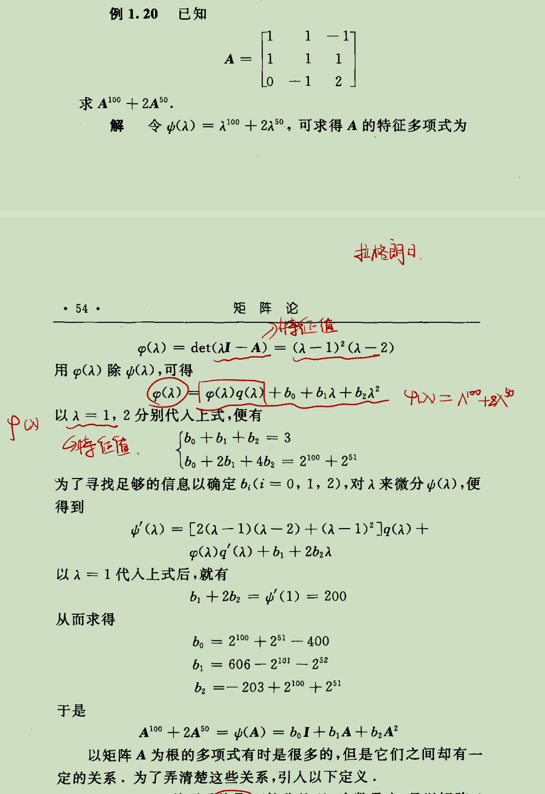

- $\psi(\lambda) = \lambda^{100} + 2\lambda^{50}$
- $\varphi(\lambda) = det(\lambda I-A) = (\lambda-1)^2(\lambda-2)$
- 用$\varphi(\lambda)$除$\psi(\lambda)$，可得$\psi(\lambda) = \varphi(\lambda)q(\lambda)+b_0+b_1\lambda + b_2\lambda^2$
- $\psi(\lambda) = \varphi(\lambda)q(\lambda)+b_0+b_1\lambda + b_2\lambda^2$是怎么来的
  - 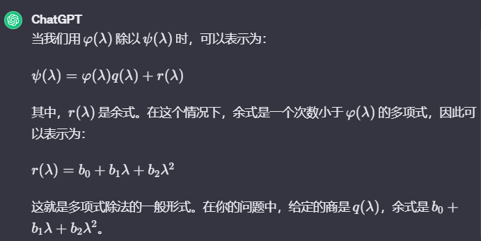

- 当$\varphi(\lambda)$为四次方，余式是什么样的
  - 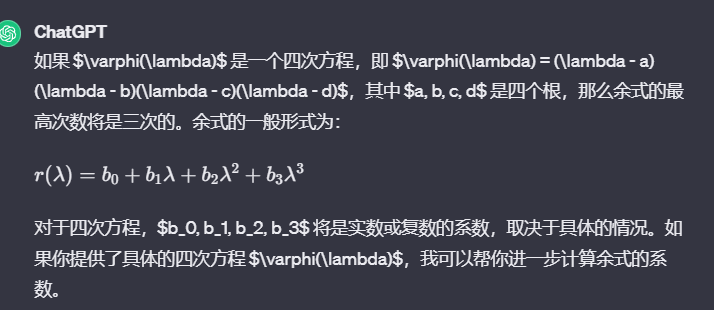

## Unit2

- $l_2$
  - 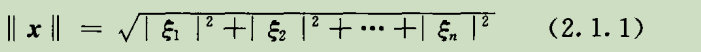
- $l_\infty$
  - 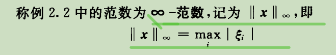
- $l_1$
  - 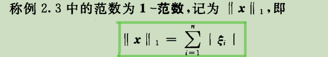
- $l_p$
  - 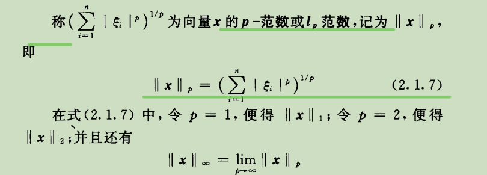

- 定理2.1
  - 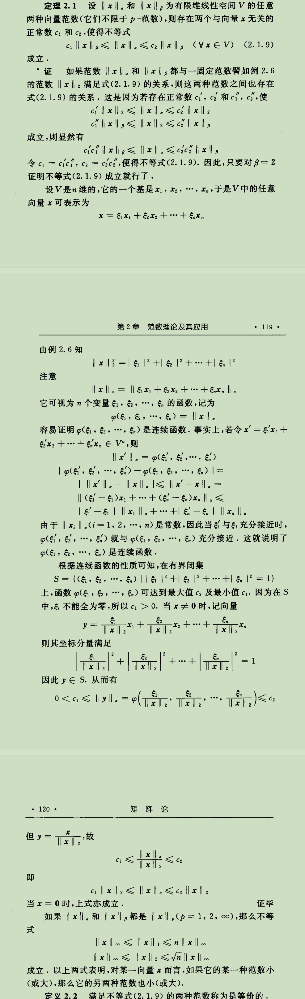
- 证明范数等价
- 习题2.1.5
  - 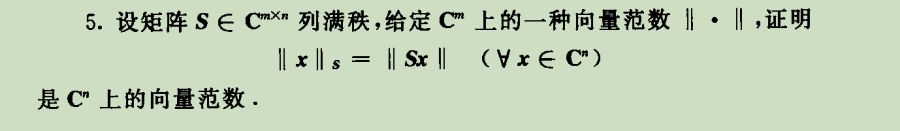
  - 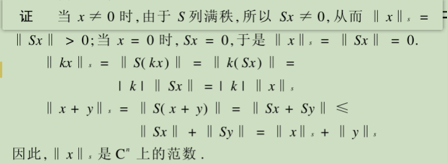

## Unit3

- $x = (\xi_1,\xi_2,\dots,\xi_n)$
- $f_j(x) = f_j(\xi_1,\xi_2,\dots,\xi_n)(j=1,2,\dots,n)$
- $F(x) = (f_1(x),f_2(x),\dots,f_n(x))^T$, F(x)是一个行向量还是列向量
- 定义3.12
  - 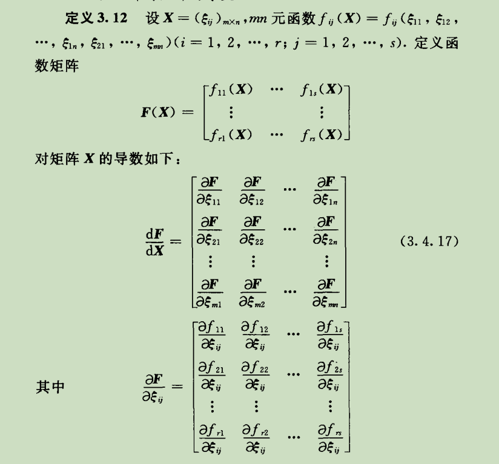
- 例子3.14
  - 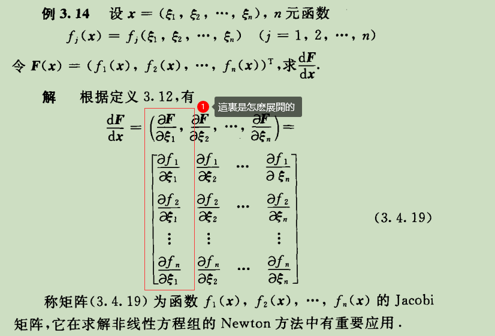

## Unit4

- 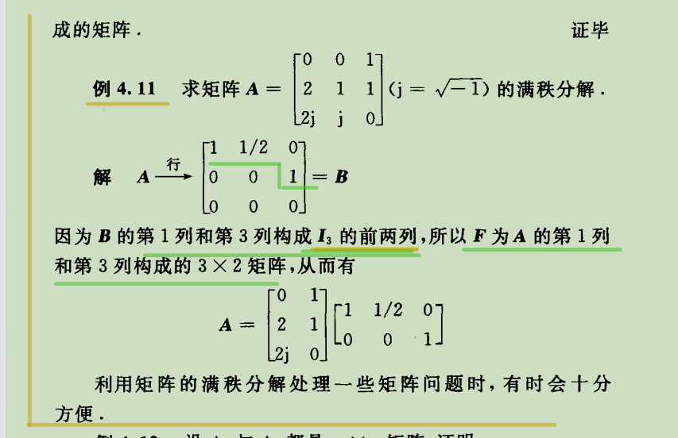

## Unit5

- 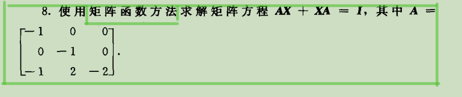
  - 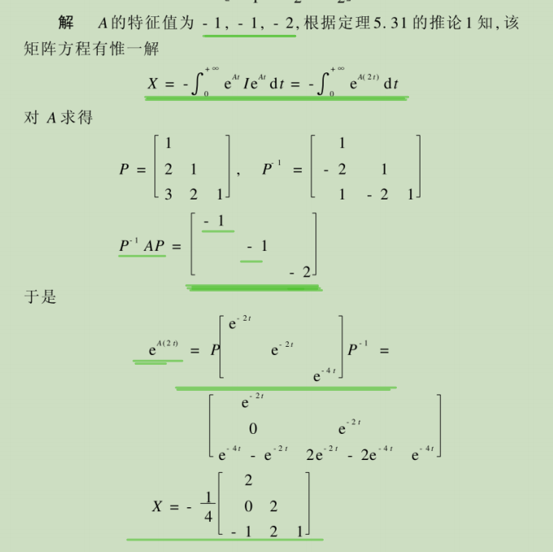

已知

$$
P^{-1}AP =
\begin{bmatrix}
  -1 & 0 & 0 \\
  0 & -1 & 0  \\
  0 & 0 & -2 \\
\end{bmatrix}
$$

$$
A =
\begin{bmatrix}
  -1 & 1   \\
  -1 & -1   \\
\end{bmatrix}
$$

介绍全部求$A^-1$的方法

WHY

$$
e^{A(2t)} =
\begin{bmatrix}
  e^{-2t} & 0 & 0 \\
  0 & e^{-2t} & 0  \\
  0 & 0 & e^{-4t} \\
\end{bmatrix}
$$

- 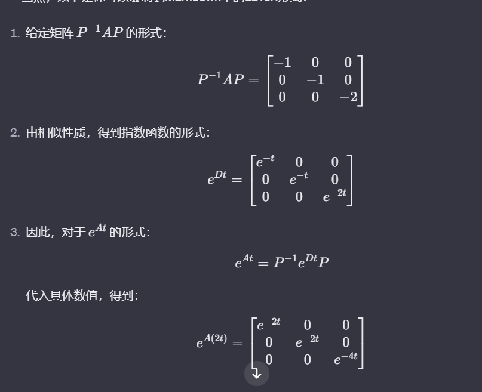

特征值满足$Re(\lambda_i)<0$,$Re(\mu_i)<0$,$\lambda$和$\mu$是什么

## Unit6
